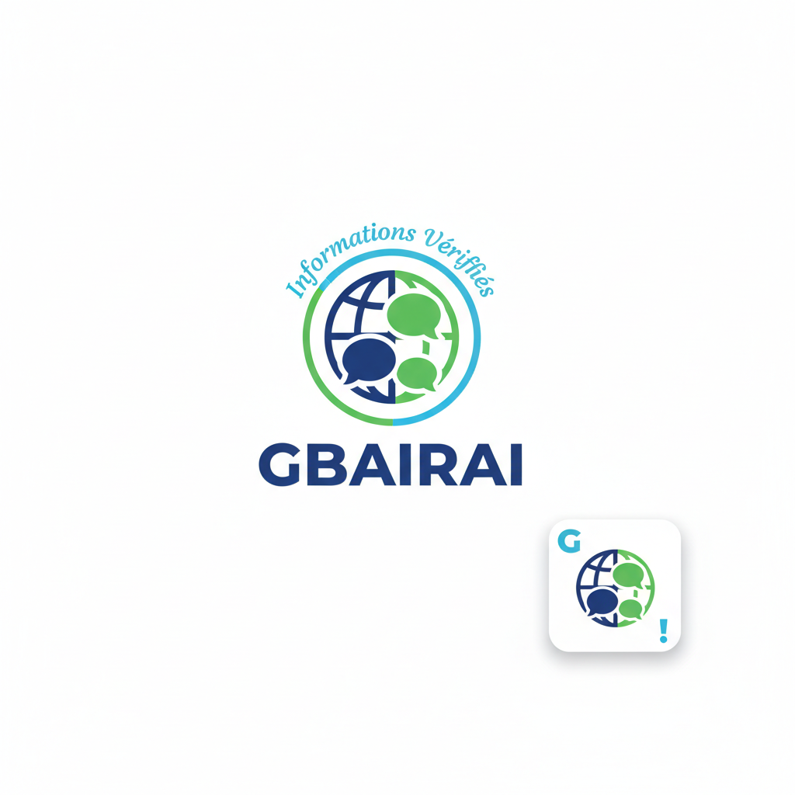
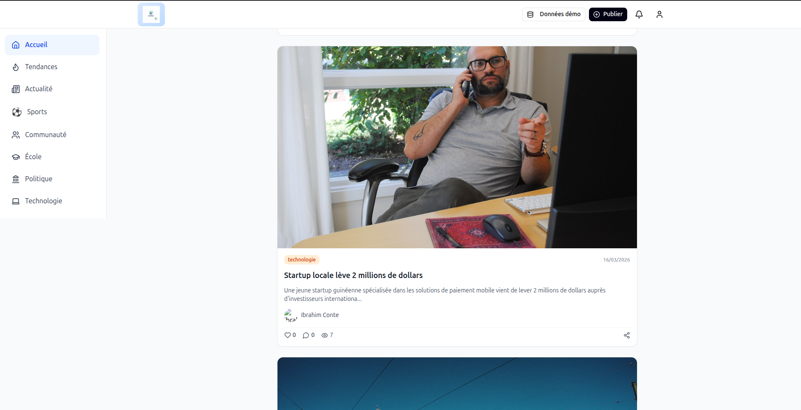

# Journal Collab - Plateforme de Journalisme Collaboratif



Une application web moderne et interactive pour la diffusion d'informations communautaires, construite avec React et les meilleures technologies frontend.

## 📸 Aperçu de l'Application



## 🌟 Fonctionnalités

- **Interface utilisateur moderne** avec Tailwind CSS et composants UI personnalisés
- **Design responsive** adapté à tous les appareils (mobile, tablette, desktop)
- **Navigation intuitive** avec React Router v7
- **Scroll infini** pour une navigation fluide dans les articles
- **Système de likes** et de statistiques (vues, commentaires)
- **Filtres par catégorie** et par popularité
- **Création d'articles** avec éditeur riche
- **Profil utilisateur** avec statistiques personnelles
- **Section tendances** pour les articles populaires
- **Toast notifications** pour le feedback utilisateur

## 🛠️ Stack Technique

### Frontend

- **React 18.3.1** - Bibliothèque principale avec hooks
- **TypeScript** - Typage statique strict
- **Vite** - Outil de build ultra-rapide
- **React Router v7** - Routage client moderne

### UI & Styling

- **Tailwind CSS v4** - Framework CSS utilitaire
- **Radix UI** - Composants accessibles et headless
- **Lucide React** - Icônes modernes et cohérentes
- **Sonner** - Système de toast notifications

### État & Logique

- **TanStack Query** - Gestion d'état serveur et cache
- **React Hook Form** - Gestion de formulaires
- **Supabase** - Base de données et authentification

### Architecture

- **Feature-based structure** - Organisation par fonctionnalités
- **Shared components** - Composants réutilisables
- **Custom hooks** - Logique métier réutilisable
- **TypeScript strict** - Sécurité du typage

## 🚀 Démarrage Rapide

### Prérequis

- Node.js 18+
- npm, yarn ou pnpm

### Installation

1. **Cloner le dépôt**

    ```bash
    git clone <url-du-repository>
    cd "journal - frontend"
    ```

2. **Installer les dépendances**

    ```bash
    npm install
    # ou
    yarn install
    # ou
    pnpm install
    ```

3. **Démarrer le serveur de développement**

    ```bash
    npm run dev
    # ou
    yarn dev
    # ou
    pnpm dev
    ```

4. **Ouvrir votre navigateur**
   Navigatez vers `http://localhost:5173`

## 📜 Scripts Disponibles

```bash
# Démarrer le serveur de développement
npm run dev

# Construire pour la production
npm run build

# Prévisualiser le build de production
npm run preview
```

## 🏗️ Architecture du Projet

```
src/
├── app/                    # Configuration de l'application
│   ├── App.tsx            # Composant racine
│   └── routes.ts          # Configuration des routes
├── features/               # Fonctionnalités par domaine
│   ├── posts/             # Gestion des articles
│   │   ├── components/    # Composants spécifiques aux posts
│   │   └── hooks/         # Hooks métier des posts
│   ├── profile/           # Gestion des profils
│   └── trending/          # Section tendances
├── shared/                 # Éléments partagés
│   ├── components/        # Composants réutilisables
│   │   ├── layout/        # Composants de layout
│   │   └── ui/            # Composants UI de base
│   ├── pages/             # Pages de l'application
│   ├── services/          # Services externes
│   │   ├── api/           # Services API
│   │   └── database/      # Services base de données
│   ├── types.ts           # Types TypeScript partagés
│   ├── utils/             # Fonctions utilitaires
│   └── assets/            # Images et ressources
├── config/                 # Configuration de l'application
├── constants/              # Constantes partagées
└── styles/                 # Styles globaux
```

## 🎨 Design & UX

L'application suit les principes de design moderne :

- **Mobile-first** avec responsive design adaptatif
- **Accessibilité** avec composants sémantiques et ARIA
- **Performance** avec lazy loading et optimisation des images
- **Animations fluides** pour une expérience utilisateur agréable
- **Interface épurée** avec hiérarchie visuelle claire

## 🔧 Configuration

### Variables d'Environnement

Créez un fichier `.env.local` à la racine du projet :

```env
VITE_API_URL=http://localhost:3001
VITE_SUPABASE_URL=votre_supabase_url
VITE_SUPABASE_ANON_KEY=votre_supabase_anon_key
```

### Personnalisation du Thème

Les couleurs et le thème peuvent être personnalisés dans :

- `src/styles/globals.css` - Styles globaux et thème
- `tailwind.config.js` - Configuration Tailwind CSS
- `src/config/app.config.ts` - Configuration de l'application

## 🤝 Contribuer

1. Fork le projet
2. Créer une branche feature (`git checkout -b feature/nouvelle-fonctionnalite`)
3. Commit les changements (`git commit -m 'Ajouter nouvelle fonctionnalité'`)
4. Push vers la branche (`git push origin feature/nouvelle-fonctionnalite`)
5. Ouvrir une Pull Request

## � Fonctionnalités Clés

### � Gestion des Articles

- **Création d'articles** avec éditeur riche
- **Catégorisation** automatique
- **Gestion des images** avec upload
- **Validation du contenu** avant publication

### 📊 Statistiques et Engagement

- **Système de likes** pour les articles
- **Suivi des vues** en temps réel
- **Commentaires** interactifs
- **Partage social** des articles

### 🔍 Découverte de Contenu

- **Filtres par catégorie** (Sports, Politique, Technologie, etc.)
- **Tri par pertinence** ou par date
- **Scroll infini** pour une navigation fluide
- **Section tendances** pour le contenu populaire

### 👤 Profil Utilisateur

- **Tableau de bord personnel** avec statistiques
- **Historique des publications**
- **Gestion du profil** et préférences

## 🛡️ Sécurité

- **Validation des entrées** côté client et serveur
- **Protection XSS** avec échappement automatique
- **Authentification sécurisée** via Supabase
- **CORS configuré** pour les API externes

### Conventions de Code

- **TypeScript strict** pour tous les fichiers
- **Composants fonctionnels** avec hooks
- **Nommage cohérent** en français pour l'interface
- **Tests unitaires** pour la logique métier

## 🌐 Lien Figma

Le design original est disponible sur :
[Journal Collab - Figma](https://www.figma.com/make/pCYM14EoYCsM3v7emrMqu4/Application-d-information-communautaire?t=PTL82dSzOtUxfMHH-1)

## 📄 Licence

Ce projet est sous licence privée.

## 📞 Support

Pour toute question ou problème, veuillez contacter l'équipe de développement.

---

**Développé avec ❤️ pour la communauté GBAIRAI**
